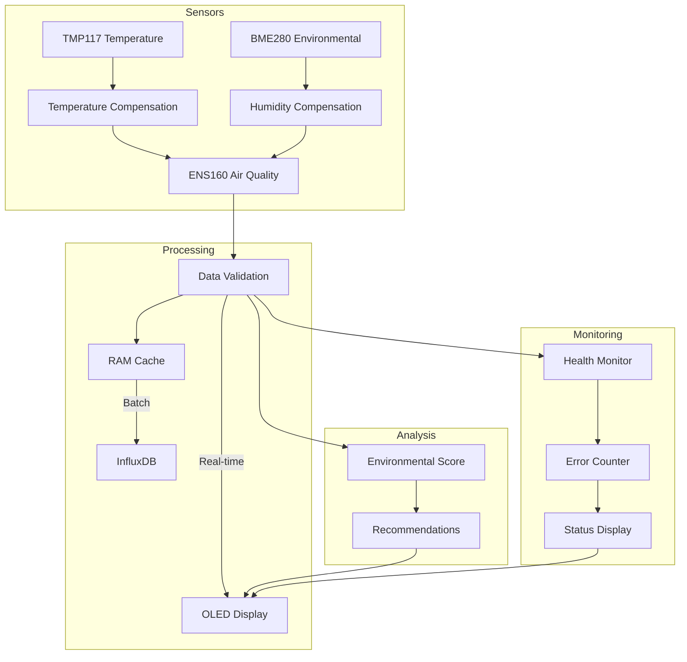

# Raspberry Pi Environmental Monitoring System

## Overview
This system monitors indoor air quality and environmental conditions using multiple sensors connected to a Raspberry Pi. It features real-time monitoring, data visualization, and automatic data logging to InfluxDB.

## Hardware Components
- ENS160 Air Quality Sensor (VOC, eCO2, AQI)
- BME280 Environmental Sensor (Temperature, Pressure, Humidity)
- TMP117 High-Precision Temperature Sensor
- SSD1306 OLED Display

## Features

### Real-time Monitoring
- Temperature (°C)
- Humidity (%RH)
- Atmospheric Pressure (hPa)
- Air Quality Index (1-5 scale)
- Total Volatile Organic Compounds (TVOC) in ppb
- Equivalent CO2 (eCO2) in ppm

### Data Validation & Health Monitoring
- Automatic range validation for all sensor readings
- Sensor health tracking and error counting
- Fresh reading detection
- Operational status monitoring
- Error threshold monitoring

### Data Management
- Configurable measurement intervals
- RAM-based data caching
- Batch data transmission to InfluxDB
- Automatic retry mechanism for failed transmissions
- Configurable transmission intervals

### Display Interface
Multiple display pages showing:
1. Main readings (Temperature, Humidity, Pressure, AQI)
2. Detailed air quality data (AQI, TVOC, eCO2)
3. Temperature history graph
4. Sensor health status
5. Environmental recommendations

### Environmental Analysis
- Real-time air quality scoring
- Dynamic recommendations based on:
  - CO2 levels
  - TVOC levels
  - Humidity conditions
- UBA (German Federal Environmental Agency) guideline compliance

## Data Flow
1. **Sensor Reading**
   - Temperature compensation from TMP117
   - Humidity compensation from BME280
   - ENS160 air quality measurements
   
2. **Data Validation**
   - Range checking for all values
   - Operational status verification
   - Sensor health monitoring

3. **Data Processing**
   - Environmental score calculation
   - Recommendation generation
   - History tracking for graphing

4. **Data Storage**
   - RAM-based circular buffer
   - Batch processing for InfluxDB
   - Configurable cache size

5. **Data Display**
   - OLED display updates
   - Console logging
   - Multiple information pages

## System Architecture



## Sensor Ranges and Accuracy

### ENS160 Air Quality Sensor
- AQI: 1-5 (UBA Guidelines)
  - 1: Excellent
  - 2: Good
  - 3: Moderate
  - 4: Poor
  - 5: Unhealthy
- TVOC: 0-65,000 ppb
- eCO2: 400-65,000 ppm

### BME280 Environmental Sensor
- Temperature: -40°C to +85°C
- Humidity: 0-100% RH
- Pressure: 300-1100 hPa

### TMP117 Temperature Sensor
- Range: -55°C to +150°C
- Accuracy: ±0.1°C (0°C to +65°C)

## Display Layout

### Page 1: Main Display
```
+----------------+
|Temp: 23.5C    |
|Humid: 45.2%   |
|Press: 1013.2  |
|Air Quality:   |
|Excellent      |
+----------------+
```

### Page 2: Air Quality
```
+----------------+
|Air Quality Data|
|AQI: 1/5       |
|TVOC: 250ppb   |
|CO2: 800ppm    |
+----------------+
```

### Page 3: Temperature Graph
```
+----------------+
|Temp History   |
|     ___       |
|    /   \      |
|___/     \_____|
|L:22.1 H:24.3  |
+----------------+
```

### Page 4: Health Status
```
+----------------+
|Sensor Health   |
|✓ temp_sensor   |
|✓ air_quality   |
|✓ atmospheric   |
+----------------+
```

### Page 5: Recommendations
```
+----------------+
|Air Quality     |
|Level: Good     |
|Open windows    |
|for fresh air   |
+----------------+
```

## Data Schema

### InfluxDB Measurement Structure
```
Measurement: sensorReading
Tags:
  - sensor: "PiicoDevSensors"
  - location: <room_name>
Fields:
  - temperature: float
  - humidity: float
  - pressure: float
  - aqi: integer
  - tvoc: integer
  - eco2: integer
  - aqi_rating: string
  - eco2_rating: string
  - sensor_status: string
Timestamp: unix_timestamp
```

## Configuration
Key configurable parameters:
- Measurement intervals
- Display pages
- InfluxDB settings
- Cache sizes
- Health check thresholds
- Sensor ranges
- Environmental thresholds

## Error Handling
- Graceful degradation with sensor failures
- Last known good value retention
- Automatic recovery attempts
- Comprehensive logging
- Signal handling for clean shutdown

## Dependencies
- PiicoDev sensor libraries
- InfluxDB client
- Python standard library

## Installation

### Prerequisites
```bash
# Required system packages
sudo apt-get update
sudo apt-get install -y python3-pip python3-smbus i2c-tools

# Enable I2C interface
sudo raspi-config  # Navigate to Interface Options -> I2C -> Enable

# Verify I2C devices
sudo i2cdetect -y 1
```

### Python Dependencies
Create a requirements.txt:
```
influxdb-client>=1.24.0
PiicoDev>=1.4.0
```

Install dependencies:
```bash
pip3 install -r requirements.txt
```

### InfluxDB Setup
1. Install InfluxDB on your server
2. Create a bucket named "sensorData"
3. Generate an API token with write access
4. Set environment variable:
```bash
export INFLUXDB_TOKEN="your-token-here"
```

### Configuration
Edit the CONFIG dictionary in the script to match your setup:
```python
CONFIG = {
    'MEASUREMENT_INTERVAL_MS': 1000,  # Adjust sampling rate
    'INFLUXDB': {
        'URL': "http://your-influx-server:8086",
        'ORG': "your-org",
        'BUCKET': "sensorData",
    },
    'SENSOR_LOCATION': "room-name"    # Identify sensor location
}
```

### Running the Script
```bash
python3 ens160AirQualitySensor.py
```

Add to system startup (optional):
```bash
# Create service file
sudo nano /etc/systemd/system/air-quality.service

# Add the following content:
[Unit]
Description=Air Quality Monitoring
After=network.target

[Service]
Environment=INFLUXDB_TOKEN=your-token-here
ExecStart=/usr/bin/python3 /path/to/ens160AirQualitySensor.py
WorkingDirectory=/path/to/script/directory
Restart=always
User=pi

[Install]
WantedBy=multi-user.target

# Enable and start service
sudo systemctl enable air-quality
sudo systemctl start air-quality
```

## Troubleshooting

### Common Issues
1. **Sensor Not Found**
   - Check I2C connections
   - Verify I2C addresses: `sudo i2cdetect -y 1`
   - Check power supply

2. **InfluxDB Connection Errors**
   - Verify network connectivity
   - Check token permissions
   - Confirm bucket exists

3. **Display Issues**
   - Verify I2C address conflicts
   - Check display orientation
   - Validate power supply

### Logging
The script logs to stdout with timestamp and level:
```
2023-XX-XX HH:MM:SS - INFO - Starting sensor monitoring...
2023-XX-XX HH:MM:SS - INFO - All sensors initialized successfully
```

Monitor logs with:
```bash
# If running as service
journalctl -u air-quality -f

# If running directly
python3 ens160AirQualitySensor.py | tee sensor.log
```

## Maintenance

### Regular Tasks
1. Check sensor readings against known good values
2. Monitor error counts in logs
3. Verify InfluxDB data ingestion
4. Clean display screen if needed

### Calibration
The ENS160 sensor features automatic baseline correction. For best results:
1. Allow 24-48 hours of operation for initial baseline
2. Ensure regular fresh air exposure
3. Maintain stable temperature and humidity

## Contributing
Feel free to submit issues and enhancement requests!

## Note
The system requires the ENS160 sensor to report "operating ok" status before recording data, ensuring accuracy of air quality measurements.

## Interpreting Air Quality Readings

### ENS160 Sensor Characteristics
- Metal oxide (MOX) sensor technology
- Built-in temperature and humidity compensation
- Automatic baseline correction
- UBA-compliant air quality ratings

### Air Quality Index (AQI) Response Guide
1. **Excellent (1)**
   - Ideal indoor air quality
   - No action needed
   - Typical in well-ventilated spaces

2. **Good (2)**
   - Normal indoor conditions
   - Continue regular ventilation
   - Monitor for changes

3. **Moderate (3)**
   - Some air quality deterioration
   - Increase ventilation
   - Check for pollution sources

4. **Poor (4)**
   - Significant air quality issues
   - Open windows immediately
   - Activate air purifiers if available
   - Identify and remove pollution sources

5. **Unhealthy (5)**
   - Severe air quality problems
   - Evacuate if necessary
   - Maximum ventilation required
   - Professional assessment recommended

### TVOC (Total Volatile Organic Compounds)
- **Low (0-500 ppb)**
  - Normal indoor conditions
  - No action needed

- **Moderate (500-2000 ppb)**
  - Increased VOC presence
  - Improve ventilation
  - Check for new furnishings or cleaning products

- **High (2000-5000 ppb)**
  - Significant VOC levels
  - Identify and remove sources
  - Consider air purification

- **Very High (>5000 ppb)**
  - Immediate action required
  - Maximum ventilation
  - Evacuate if necessary

### eCO2 (Equivalent CO2) Guidelines
- **400-800 ppm**
  - Excellent air quality
  - Normal outdoor to indoor levels

- **800-1000 ppm**
  - Good air quality
  - Typical occupied indoor space

- **1000-1500 ppm**
  - Fair air quality
  - Increase ventilation recommended

- **1500-2000 ppm**
  - Poor air quality
  - Open windows
  - Check ventilation systems

- **>2000 ppm**
  - Unacceptable air quality
  - Immediate ventilation required
  - Check for CO2 sources

### Best Practices for Accurate Readings
1. **Sensor Placement**
   - Avoid direct sunlight
   - Keep away from direct airflow
   - Place at breathing height
   - Maintain distance from walls

2. **Baseline Calibration**
   - Allow initial 24-48 hour baseline period
   - Regular exposure to fresh air
   - Avoid placement near pollution sources

3. **Environmental Conditions**
   - Maintain stable temperature
   - Control humidity levels
   - Avoid rapid environmental changes

4. **Maintenance**
   - Regular dust cleaning
   - Periodic baseline recalibration
   - Validation against known conditions

### Response Actions Matrix
```
Condition          | Immediate Action      | Long-term Action
-------------------|----------------------|------------------
High TVOC          | Open windows         | Find VOC sources
High eCO2          | Increase ventilation | Check HVAC
Poor AQI           | Air purification     | Environmental audit
High Humidity      | Dehumidification    | Check for leaks
Low Humidity       | Use humidifier      | Monitor heating
```

## Additional Resources
- [ENS160 Datasheet](https://www.sciosense.com/products/environmental-sensors/ens160-digital-metal-oxide-multi-gas-sensor/)
- [WHO Air Quality Guidelines](https://www.who.int/publications/i/item/9789240034228)
- [UBA Indoor Air Quality Guidelines](https://www.umweltbundesamt.de/en/topics/health/environmental-impact-on-people/indoor-air)